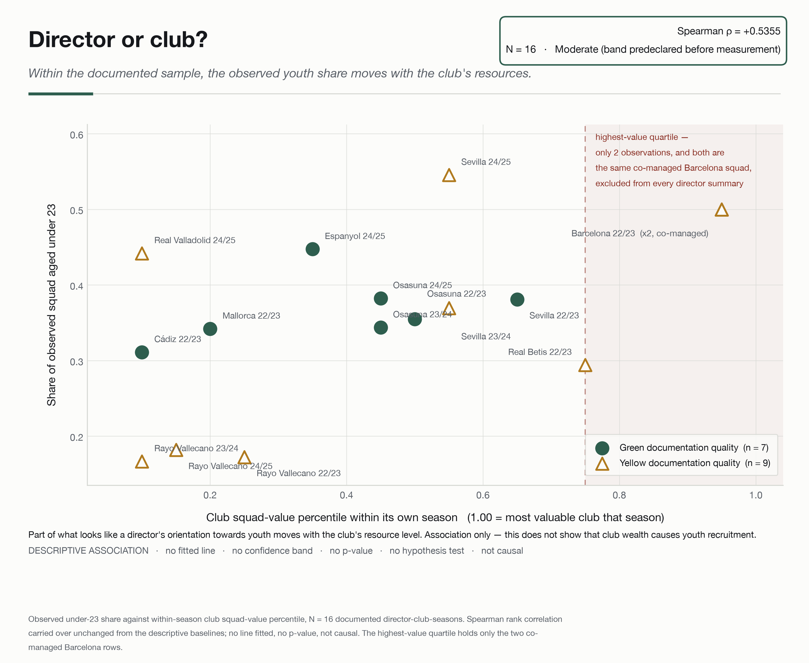
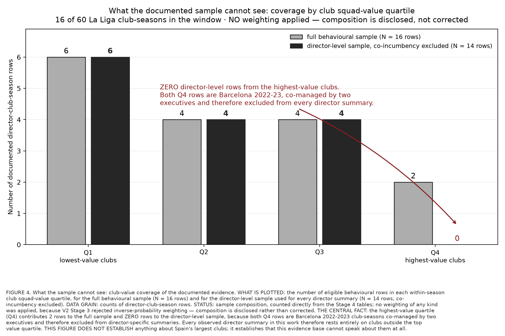

# Director or Club?

## Observed Squad-Construction Patterns of Sporting Directors in Spanish Football

**MIT Sloan Sports Analytics Conference research — Problem 10 · Soccer**

> This public release contains the final abstract, verified aggregate evidence, figures, and a
> release verifier. Raw, player-level, and canonical director-club-season data are excluded because
> their redistribution rights have not been established. Reproducibility is therefore **partial**.

[**Read the MIT Sloan abstract**](paper/Problem10_Director_or_Club_MIT_Sloan_Abstract.pdf)

## Research question

Across documented Spanish top-flight director-seasons, do observable squad-construction patterns
differ between Sporting Directors, and how much of that apparent difference moves with club context
rather than the person?

This is a descriptive study. It does not rank Sporting Directors, recommend appointments, estimate
causal director effects, measure transfer profitability, or predict executive performance.

## Why this matters

Clubs often discuss an executive's recruitment identity as though it were a stable personal trait.
Public evidence rarely supports that confidence. Job titles vary, authority is seldom documented,
and the observed squad also reflects the club, season, and resources around the executive.

The practical contribution is an evidence standard. Before treating a squad profile as a Sporting
Director's signature, ask how many seasons, different clubs, and resource tiers support it.

## What we can actually observe

A documented Sporting Director attached to a club-season establishes role exposure: incumbency is exposure,
not decision authority. It does not
establish that the person personally decided a signing, sale, loan, retention decision, or the full
squad composition. The study therefore describes the **observed squad associated with the documented
director-club-season**.

Market value is used as a proxy. It is not a transfer fee, club budget, spending measure, profit, or
accounting value. Player movement inferred from squad membership is not an observed transaction and
is not used in the headline findings.

## Dataset

The project uses a two-layer canonical panel built from verified evidence only, without synthetic
observations or sample-expanding imputation.

| Layer | Rows | Directors | Clubs | Seasons |
|---|---:|---:|---:|---:|
| Context | 44 | 13 | 14 | 7 |
| Behavioural | 16 | 10 | 9 | 3 |
| Director summaries, after excluding two co-incumbent rows | 14 | 8 | — | — |

Inclusion depends on documentation availability, not random sampling. No weighting correction was
applied because the selection mechanism cannot be estimated. Every conclusion therefore applies
only **within the documented sample**.

## Four squad-construction measures

The four behavioural measures were fixed before the results were examined:

1. median squad age;
2. under-23 share;
3. 30-plus share;
4. top-five value concentration.

Three candidate valuation variables were moved to club context after correlations of approximately
0.994–0.998 with squad value. Retaining them as director characteristics would largely rediscover
club wealth and risk presenting it as executive behaviour.

## Methodological design

The analysis reports distributions in football units, director summaries with their observation
bases, a predeclared grid of Spearman rank associations, and documentation-quality and season
sensitivity checks. Green and yellow documentation-quality observations form the primary sample;
green-only results are diagnostic.

No mixed-effects model, clustering, dimensionality reduction, outcome regression, predictive model,
hypothesis test, p-value, ranking, rating, or suitability score was produced. With 16 behavioural
rows, six of ten directors observed once, and only two observed at multiple clubs, fitting such a
model would imply precision the evidence cannot support.

## Main findings

Observed median squad age ranges from approximately **22.4 to 28.4 years**, under-23 share from
**0.17 to 0.55**, 30-plus share from **0.11 to 0.31**, and top-five value concentration from
**0.29 to 0.55**. Between-director spread exceeds the median within-director range on all four
measures, and this ordering survives the green-only documentation-quality sensitivity.

That pattern is not evidence of intrinsic individual style. Club context, season, and selective
observability remain entangled with the person.

### Club-resource association



*Figure 1. Youth share versus club resource level. Spearman rho = +0.5355, n = 16. This is a
descriptive association only: no fitted line, confidence band, p-value, hypothesis test, or causal
claim.*

Within the documented sample, under-23 share moves with the club's within-season squad-value
percentile (**Spearman rho = +0.5355, n = 16**). This does not show that club wealth causes youth
recruitment or that Sporting Directors at wealthier clubs prefer young players.

### Season dependence

For the 30-plus share, the spread of season medians is approximately **1.88 times** the full-sample
IQR. Differences between directors observed in different seasons may therefore partly reflect the
season environment. With only three behavioural seasons, this is not a time trend.

### Coverage gap



*Figure 2. Full behavioural sample: Q1 = 6, Q2 = 4, Q3 = 4, Q4 = 2. Director-level sample:
Q1 = 6, Q2 = 4, Q3 = 4, Q4 = 0. The two Q4 rows represent the same co-managed Barcelona 2022–23
club-season and are excluded from director summaries.*

Every director-level summary rests entirely on clubs outside the highest squad-value quartile. The
study therefore cannot make director-level claims about Spain's wealthiest clubs.

### Multi-club evidence

Only two directors in the behavioural layer are observed at two clubs, and none is observed at
three. In both cases club, season, and resource level change together. The study cannot establish
whether an apparent operating profile travels between clubs.

## What the evidence does not establish

- which Sporting Director is best;
- whether one director caused a squad profile;
- whether a documented incumbent personally made individual personnel decisions;
- whether an apparent profile is intrinsic or portable across clubs;
- transfer spending, fees, profit, or trading margin;
- predictive performance or hiring suitability;
- representative patterns for La Liga as a whole.

## Reproducibility

The private scientific project records **108 frozen artifacts across four manifests with zero
mismatches** at the final audit. In plain terms: 108 artifacts, zero mismatches. That establishes
internal artifact integrity. It does not make the
entire pipeline reproducible from this public repository.

This release includes aggregate result tables and a verifier:

```bash
python scripts/verify_release.py
```

The command checks the public paper hash, headline sample sizes, ranges, association, season ratio,
coverage gap, figure hashes, and prohibited-claim boundaries. Rebuilding the canonical panels or
figures requires restricted upstream inputs and is intentionally unavailable here.

## Repository structure

```text
assets/          researcher and collaboration images
data/            data dictionary and redistribution boundary
docs/            methodology and reproducibility documentation
figures/         two verified aggregate scientific figures
paper/           final abstract PDF
results/tables/  public-safe aggregate evidence and claim audits
scripts/         standalone release verifier
```

## Researcher

<p align="left">
  
</p>

### Rupayan Halder

**PhD Student — Jadavpur University, Kolkata**\
**Football AI Researcher**\
**Assistant Professor — University of Engineering & Management (UEM), Kolkata**\
**Research Collaborator — SoccerSolver**\
**Former Software Engineer — Platform Engineering — Session AI**

Rupayan's research interests focus on applying artificial intelligence, machine learning, data
analytics, and computational methods to real-world problems in football, including player
performance analysis, recruitment, transfer-market decision-making, and sporting strategy.

### Connect

[GitHub](https://github.com/RupayanHalder39) ·
[LinkedIn](https://www.linkedin.com/in/rupayan-halder-962922209/) ·
[Email](mailto:rupayanhalder313239@gmail.com)

---

## Research Collaboration

<p align="left">
  
</p>

**This research was developed in collaboration with SoccerSolver. SoccerSolver currently works with more than 10 football clubs.**

---

## Citation

Please use the metadata in [`CITATION.cff`](CITATION.cff).

## Licence

Original repository software and documentation are provided under the MIT License. This licence does
not grant rights to upstream data, market-value records, names, marks, photographs, or other
third-party material. See [`NOTICE.md`](NOTICE.md) and [`PUBLIC_RELEASE_AUDIT.md`](PUBLIC_RELEASE_AUDIT.md).
